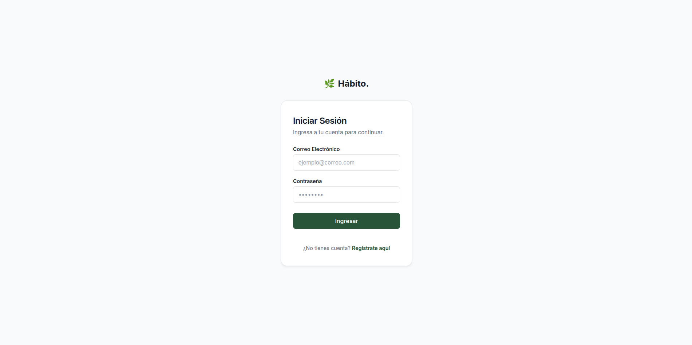
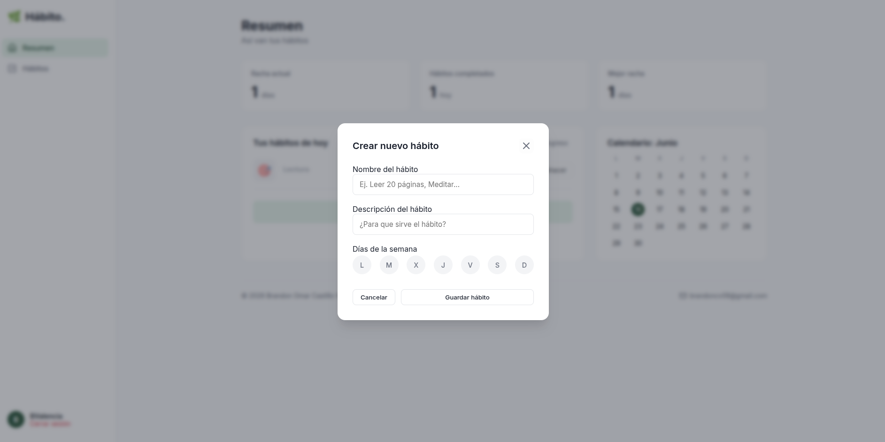
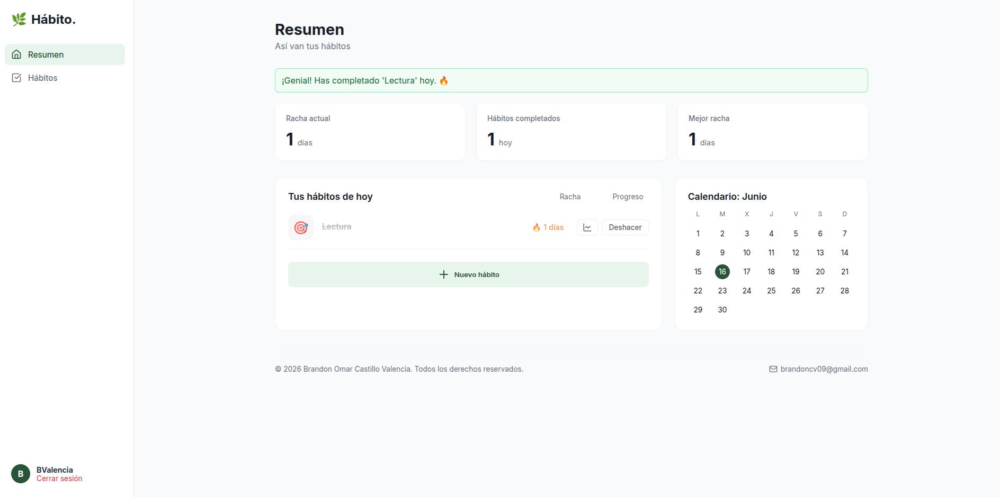
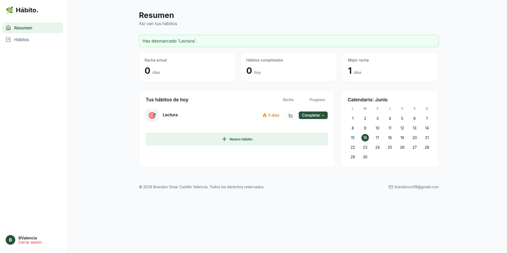
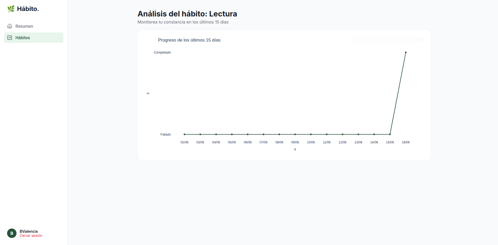
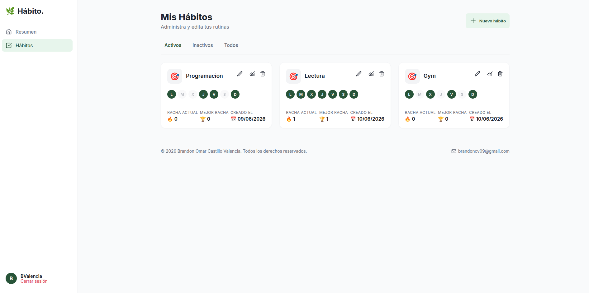
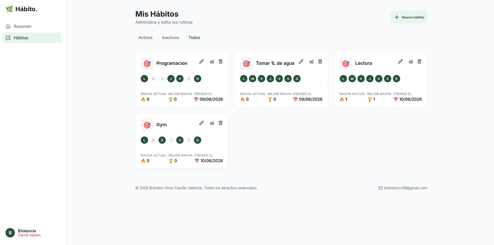
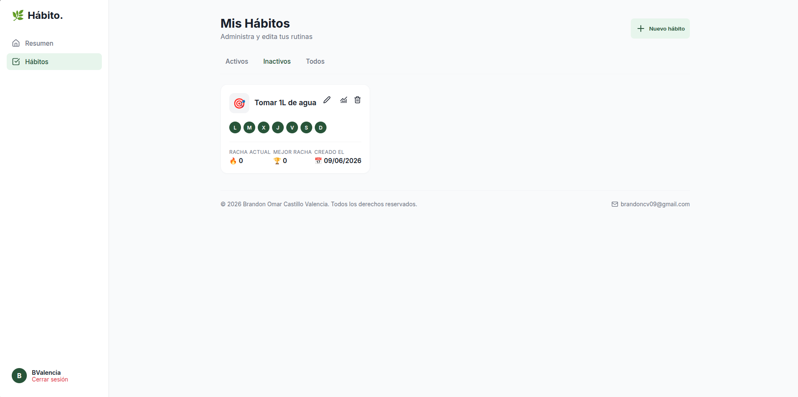
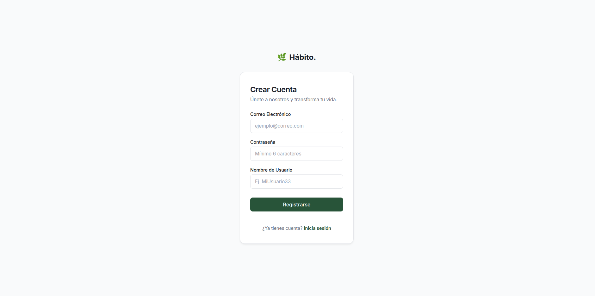

# 🌿 Hábito. - Sistema de Gestión de Hábitos

Una aplicación web robusta y moderna desarrollada con Flask para el seguimiento, gestión y análisis visual de hábitos diarios. Diseñada con una arquitectura limpia y escalable.

## 🚀 Características Principales

* **🔒 Autenticación Segura:** Sistema de registro e inicio de sesión utilizando encriptación de contraseñas con `bcrypt` y gestión de sesiones con `Flask-Login`.
* **📅 Control de Rachas:** Algoritmo automático que calcula tu racha actual y tu mejor racha histórica.
* **🔥 Mapa de Calor Mensual:** Calendario visual integrado en el panel principal (Dashboard) que se ilumina los días en los que fuiste productivo.
* **📊 Análisis y Gráficas:** Visualización interactiva del progreso de los últimos 14 días generada dinámicamente con `Plotly` y `Pandas`.
* **📱 Diseño Responsivo:** Interfaz de usuario moderna, limpia y adaptable 100% a dispositivos móviles y de escritorio, construida con HTML, CSS puro y Jinja2.
* **⚙️ Arquitectura Limpia:** Separación estricta de responsabilidades utilizando el Patrón Repositorio, Servicios y Controladores (MVC).

---

## 🛠️ Stack Tecnológico

**Backend:**
* Python 3
* Flask
* Flask-SQLAlchemy (SQLAlchemy 2.0)
* Flask-Login
* bcrypt

**Frontend:**
* HTML5 & CSS3
* Jinja2 (Motor de plantillas)
* Vanilla JavaScript
* Lucide Icons

**Ciencia de Datos & Base de Datos:**
* SQLite (Base de datos relacional)
* Plotly Express (Gráficas interactivas)
* Pandas

---

## 🏗️ Arquitectura del Proyecto

El proyecto sigue las mejores prácticas de ingeniería de software, dividiendo el sistema en capas:

* `app/models/`: Define la estructura de las tablas (`Usuario`, `Habito`, `RegistroHabito`) y sus relaciones.
* `app/repositories/`: Única capa autorizada para comunicarse con la base de datos y ejecutar consultas SQL.
* `app/services/`: Lógica de negocio compleja y cálculos analíticos (ej. generación de gráficas).
* `app/routes/`: Controladores (Blueprints) que gestionan el tráfico HTTP y validan peticiones.
* `app/templates/` & `app/static/`: Vistas (HTML) y recursos estáticos (CSS/JS) renderizados del lado del servidor.

---

## ⚙️ Instalación y Uso Local

Sigue estos pasos para ejecutar el proyecto en tu máquina local:

1. **Clona este repositorio:**
   ```bash
   git clone https://github.com/TU_USUARIO/SISTEMA_HABITOS.git
   cd SISTEMA_HABITOS
   ```

2. **Crea y activa un entorno virtual:**
   ```bash
   python -m venv venv
   # En Windows:
   venv\Scripts\activate
   # En Mac/Linux:
   source venv/bin/activate
   ```

3. **Instala las dependencias:**
   ```bash
   pip install -r requirements.txt
   ```

4. **Ejecuta la aplicación:**
   ```bash
   python main.py
   ```

5. **Abre tu navegador:**
   Visita `http://127.0.0.1:5000` para ver la aplicación en funcionamiento.

---

## 📄 Derechos de Autor y Licencia
**Todos los derechos reservados.** Este proyecto es de código cerrado y propiedad exclusiva de su autor. No se permite la copia, distribución, modificación o uso comercial de este código sin el consentimiento expreso y por escrito del autor.


## Imágenes Del Sistema
Inicio de sesión

Pagina principal

Crear hábito

Marcar un hábito como completado

Desmarcarlo

Visualizar progreso del hábito

Hábitos activos

Todos mis hábitos

Inactivos

Registro
